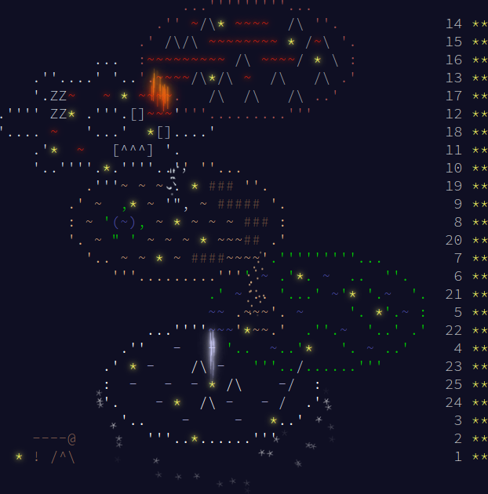
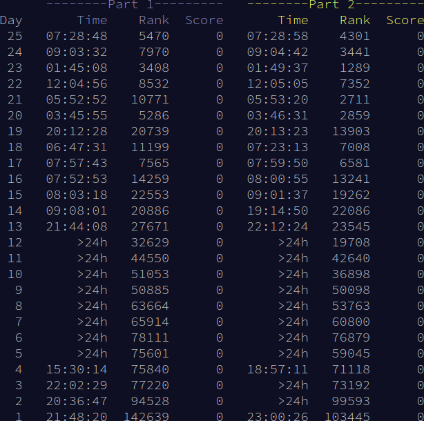

# Advent of Code

Welcome to my Advent of Code repository! This is where I document my journey
through the Advent of Code challenges, year by year. Each directory corresponds
to a specific year, containing the solutions to each day's puzzles.

## How to Build and Run

To compile and run the solutions, follow these steps:

1. First, build the `build.cpp` file located in the root directory:

    ``` shell
    $ g++ -std=c++11 -o build build.cpp
    ```

2. After building, you can run the specific solution using the following
   command to build and run the specified challenge:

    ``` shell
    $ ./build <year> <day> <part> [<input|test>] [<run>]
    ```

 - `<year>`: A 4-digit number specifying the year (e.g., 2023).
 - `<day>`: A 2-digit number specifying the day (e.g., 24).
 - `<part>`: The part number, either 1 or 2.
 - `<input|test>`: Optional file type, "input" or "test". Defaults to "input".
 - `<run>`: Optional flag to run the compiled executable. If provided, 
   the executable will be executed with the specified input or test file.

## 2015

This directory contains my solutions for the 2015 Advent of Code. It includes
input files, C++ code for both parts of each day's puzzle, and the original
prompts.

## 2023

<p align="center">
    
    
</p>

This directory contains my solutions for the 2023 Advent of Code. Each day's
directory has the input files, C++ code for both parts of the puzzles, and the
prompts.

## License

This project is licensed under the MIT License. See the [LICENSE](LICENSE) file
for more details.
