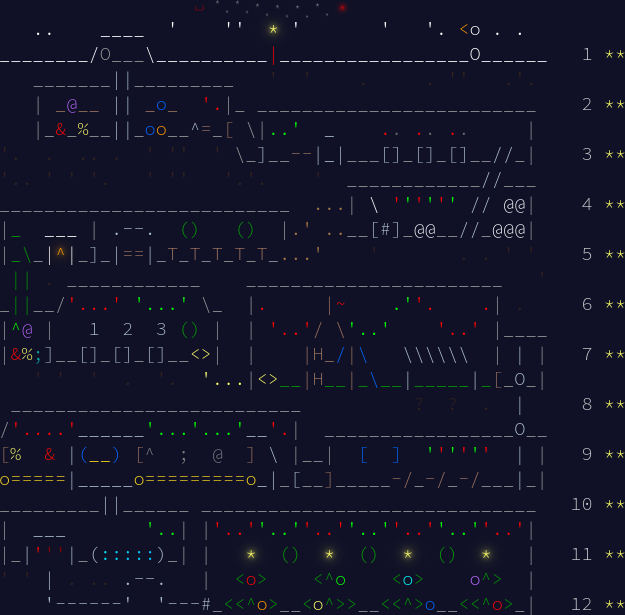
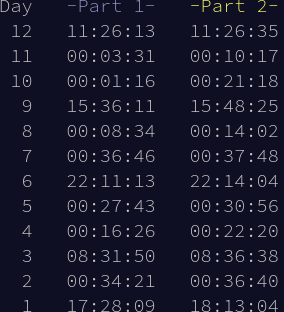

# Advent of Code

Welcome to my Advent of Code repository! This is where I document my journey
through the Advent of Code challenges, year by year. Each directory corresponds
to a specific year, containing the solutions to each day's puzzles.

## Using `aoc.sh`

The `aoc.sh` script is a unified interface to compile and run Advent of Code
solutions, run benchmarks, and interact with the Advent of Code website
(fetching input, submitting answers, etc).

### Usage

```shell
./aoc.sh <build|benchmark|aoc> ...
```

### Commands

#### Build and Run Solutions

```shell
./aoc.sh build <year> <day> <part> [input|test] [run]
```

- `<year>`: A 4-digit number specifying the AoC year (e.g., 2024)
- `<day>`: A 2-digit number specifying the day (e.g., 01)
- `<part>`: The part number (1 or 2)
- `[input|test]`: Optional input file type (default: `input`)
- `[run]`: Optional flag to run the compiled solution immediately after building

Example:
```shell
./aoc.sh build 2024 01 1 input run
```

#### Run Benchmarks

```shell
./aoc.sh benchmark <year> <day> <part> [input|test] [runs]
```

- `[runs]`: Number of benchmark runs to perform

Example:
```shell
./aoc.sh benchmark 2024 01 2 test 500
```

#### Interact with Advent of Code

```shell
./aoc.sh aoc <input|prompt|submit> [<year> <day> <part> [input|test] [run]]
```

- If `<year> <day> <part>` are provided, the script first runs the `build` tool
  to generate `aoc_args.tmp`.
- The command then delegates to the AoC tool to perform the requested action:
  - `input`: Fetch puzzle input
  - `prompt`: Fetch puzzle description
  - `submit`: Submit the current answer

Example:
```shell
./aoc.sh aoc submit 2024 01 2 input run
```

This will build the solution, prepare the arguments, and submit the answer to
Advent of Code.

## 2015

<p align="center">
    
    
</p>

This directory contains my solutions for the 2015 Advent of Code. It includes
input files, C++ code for both parts of each day's puzzle, and the original
prompts.

## 2023

<p align="center">
    
    
</p>

This directory contains my solutions for the 2023 Advent of Code. Each day's
directory has the input files, C++ code for both parts of the puzzles, and the
prompts.

## 2024

<p align="center">
    
    
</p>

This directory contains my solutions for the 2024 Advent of Code. Each day's
directory has the input files, C++ code for both parts of the puzzles, and the
prompts.

## 2025

<p align="center">
    
    
</p>

This directory contains my solutions for the 2025 Advent of Code. Each day's
directory has the input files, C++ code for both parts of the puzzles, and the
prompts.

## License

This project is licensed under the MIT License. See the [LICENSE](LICENSE) file
for more details.
