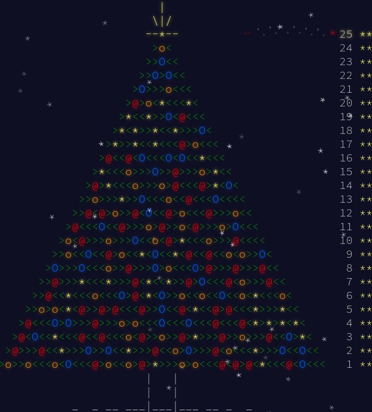
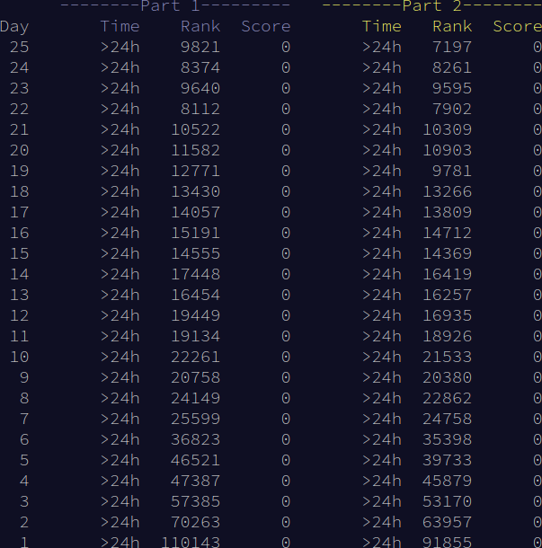
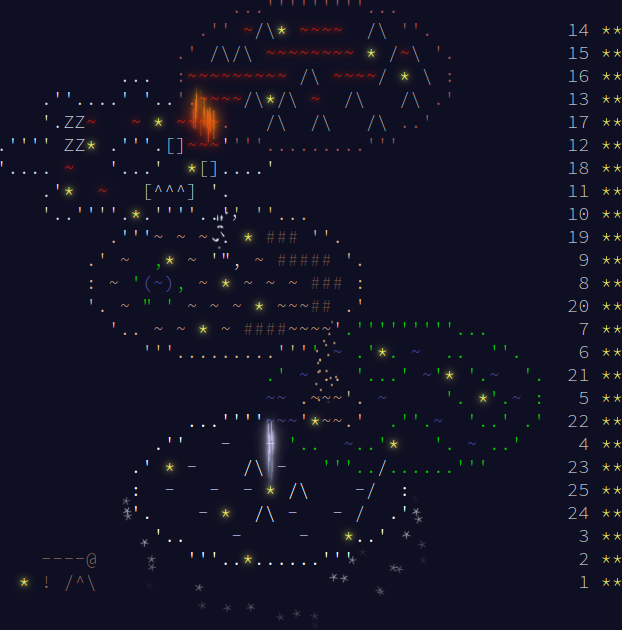
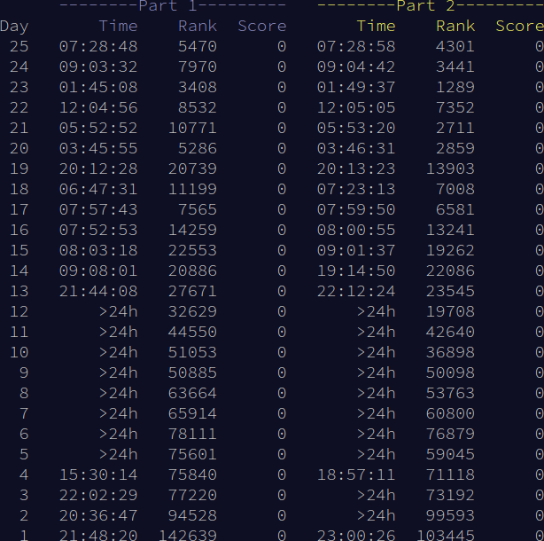
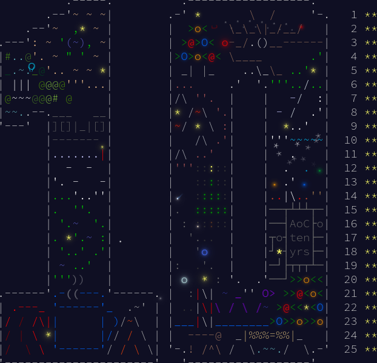
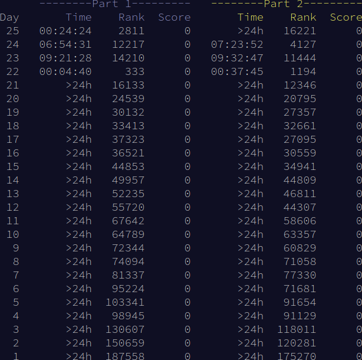

# Advent of Code

Welcome to my Advent of Code repository! This is where I document my journey
through the Advent of Code challenges, year by year. Each directory corresponds
to a specific year, containing the solutions to each day's puzzles.

## How to Build and Run

To compile and run the solutions, follow these steps:

1. First, build the `build.cpp` file located in the root directory:

    ``` shell
    $ g++ -std=c++11 -o build build.cpp
    ```

2. After building, you can run the specific solution using the following
   command to build and run the specified challenge:

    ``` shell
    $ ./build <year> <day> <part> [<input|test>] [<run>]
    ```

 - `<year>`: A 4-digit number specifying the year (e.g., 2023).
 - `<day>`: A 2-digit number specifying the day (e.g., 24).
 - `<part>`: The part number, either 1 or 2.
 - `<input|test>`: Optional file type, "input" or "test". Defaults to "input".
 - `<run>`: Optional flag to run the compiled executable. If provided, 
   the executable will be executed with the specified input or test file.

## Benchmarking Tool

To benchmark solutions and analyze performance:

1. Build the `benchmark.cpp` file:

    ```shell
    $ g++ -std=c++11 -o benchmark benchmark.cpp
    ```

2. Run the benchmarking tool:

    ```shell
    $ ./benchmark <year> <day> <part> [<input|test>] [<runs>]
    ```

 - `<year>`: A 4-digit number specifying the year (e.g., 2023).
 - `<day>`: A 2-digit number specifying the day (e.g., 24).
 - `<part>`: The part number, either 1 or 2.
 - `<input|test>`: Optional file type, "input" or "test". Defaults to "input".
 - `<runs>`: Optional number of runs. Defaults to 1000.

## Advent of Code Tool

To automate interactions with Advent of Code (fetching inputs, retrieving
problem descriptions, and submitting answers), you can use the `aoc.cpp` utility
provided in the root directory.

1. Build `aoc.cpp`

```shell
$ g++ -std=c++11 -lcurl -o aoc aoc.cpp
```

> **Note**: This requires `libcurl` to be installed.

2. Create a Session Token File

Before using the tool, create a file named `aoc.session` in the root directory
with your session token (available from your browser after logging in to Advent
of Code):

```
<your-session-token>
```

3. Usage

The `aoc` tool is used to fetch Advent of Code inputs, problem descriptions, or
submit answers.  It expects an `aoc_args.tmp` file with the following format:

```
<year> <day> <part>
ANSWER: <answer>
```

This file should be generated by the `build` tool, which runs your solution and
prepares the arguments.

4. Example usage:

- Run your solution and fetch input:
  ```shell
  ./build <year> <day> <part> && ./aoc input
  ```

- Run your solution and fetch problem description:
  ```shell
  ./build <year> <day> <part> && ./aoc prompt
  ```

- Run your solution and submit an answer:
  ```shell
  ./build <year> <day> <part> input run && ./aoc submit
  ```

Do **not** call `aoc` directly by piping arguments — it relies on the
`aoc_args.tmp` file created by `build`.

## 2015

<p align="center">
    
    
</p>

This directory contains my solutions for the 2015 Advent of Code. It includes
input files, C++ code for both parts of each day's puzzle, and the original
prompts.

## 2023

<p align="center">
    
    
</p>

This directory contains my solutions for the 2023 Advent of Code. Each day's
directory has the input files, C++ code for both parts of the puzzles, and the
prompts.

## 2024

<p align="center">
    
    
</p>

This directory contains my solutions for the 2024 Advent of Code. Each day's
directory has the input files, C++ code for both parts of the puzzles, and the
prompts.

## License

This project is licensed under the MIT License. See the [LICENSE](LICENSE) file
for more details.
